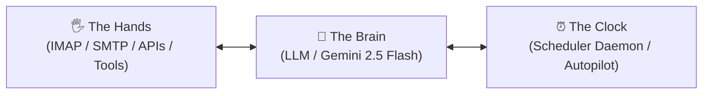

# 🌿 NEXUS™ — MASTER SYSTEM ARCHITECTURE & RUNBOOK
> **"It does what I would have been doing instead in my place. It's a second me, my partner."**  
> Finally, you can take some time off. A 24/7 sovereign digital twin and co-managing partner running quietly on your own hardware to carry your operational clutter so you can breathe, rest, and disconnect.  
> **v3.0.0 Sovereign Edition** • 16 Autonomous AI Employees • 51 Single-Task SubAgents • 25 Enterprise Defense Safeguards • 92 Modular Addons • Zero-Attack-Surface Legal Shield

[](https://www.python.org/downloads/)
[](https://fastapi.tiangolo.com)
[](https://www.docker.com/)
[](COMMERCIAL_PLAYBOOK.md)
[]()
[]()
[]()

---

## 🎨 Official Brand Identity & Trademark Lockup


* **Official Master Logo:** One unified **rectangular logo** (`220px × 54px`, `rx=6px`) with the bold black wordmark **NEXUS** fitting precisely **border to border** inside the frame.
* **Border-to-Border Precision:** The typography spans 100% of the inner container width (from the left border to the right border) and fills the height from top to bottom border.
* **Pure Clean Geometry:** **No shield icon.** No icons on the left or right.
* **Strict Placement Rule:** **No text above and no text below.**
* **Master Vector Asset:** [`static/logo.svg`](static/logo.svg)
* **Standardization Commitment:** This exact border-to-border rectangular mark represents the immutable, protected trademark for all commercial sales, client white-label deployments, software releases, and investor pitches.

---

## ☕ Why Nexus? The Feeling of "Ahhh, now I can take some time off."

Solo developers, agency founders, and builders don't burn out from coding. They burn out from the **invisible operational weight**:
* Waking up with stomach anxiety to 150+ unread emails, promos, and noisy newsletters.
* Constant fear of stepping away from the keyboard in case an invoice, server bill, or client slipped.
* Losing 15–20 hours every week to administrative exhaustion instead of creating.

**Nexus** changes the game: It is your **sovereign digital twin**.
It runs 24/7 on your local hardware or private VPS with your exact taste, standards, and loyalty. It holds the watch through the night, silences inbox chaos, guards your infrastructure, prepares market-protected pitches for your proven apps, and only contacts you on **WhatsApp (+230 58169420)** when executive discernment is needed.

When you close your laptop, you can finally exhale:
> *"Ahhh... now I can take some time off. My second self has the watch."*

---

## 🏛️ Master System Architecture

```
┌─────────────────────────────────────────────────────────────────────────────────────────┐
│                     NEXUS COMMAND CENTER & MANAGING PARTNER CONSOLE                     │
│                        http://localhost:8000 (Sovereign Web UI)                         │
└────────────────────────────────────────────┬────────────────────────────────────────────┘
                                             │
             ┌───────────────────────────────┴───────────────────────────────┐
             ▼                                                               ▼
┌─────────────────────────────────────────┐     ┌─────────────────────────────────────────┐
│        SOVEREIGN TWIN FLEET (16)        │     │        SHIELD & DEFENSE ENGINE          │
│ • Executive Partner (3 SubAgents)       │     │ • 25 Enterprise Defense Safeguards      │
│ • Email Hygiene & Anti-Spam (5 Sub)     │     │ • Pre-Flight DNS MX Deliverability Gate │
│ • Ghost Unsubscriber (3 SubAgents)      │     │ • Permanent Suppression Registry        │
│ • Night Shift Autopilot & Revenue (3)   │     │ • 14-Day Anti-Harassment Cadence Guard  │
│ • Repo Radar Watchdog (3 SubAgents)     │     │ • SMTP Velocity Throttling (15/h, 50/d) │
│ • Infra & Finance Sentinel (3 SubAgents)│     │ • CAN-SPAM / Mauritius DPA 2017 Opt-Out │
│ • App Store Sentinel (3 SubAgents)      │     │ • Zero-Phishing 2FA Immunity Shield     │
│ • Context Chief of Staff (3 SubAgents)  │     │ • Crash-Proof Atomic Storage (fsync)    │
│ • Tech Trend Curator (3 SubAgents)      │     │ • Fail-Safe Keep Default (429 Proof)    │
│ • Customer Support Concierge (3 Sub)    │     │ • Polymorphic SHA-256 Cache             │
│ • Bilingual Concierge (3 SubAgents)     │     │ • PII & Token Redaction Engine          │
│ • B2B Lead Scout (3 SubAgents)          │     │ • Circuit Breakers & Subprocess Sandbox │
│ • Meeting Coordinator (3 SubAgents)     │     └─────────────────────────────────────────┘
│ • Mobile Executive Dispatcher (3 Sub)   │                                  │
│ • Zero-Regression Sentinel (3 SubAgents)│     ┌────────────────────────────┴────────────┐
│ • Spec & Quality Auditor (3 SubAgents)  │     │       DECENTRALIZED AGENT MESH (A2A)    │
└─────────────────────────────────────────┘     │ • A2A Inter-Agent Protocol v1.2         │
                                                │ • Peer Contact Registry (mesh_contacts) │
                                                │ • Inbound Signal Receiver (/api/mesh/*) │
                                                └─────────────────────────────────────────┘
```

---

## 👥 The 16 Autonomous AI Employees

Every agent is strictly decoupled into dedicated, single-task subagents (`1 SubAgent = Exactly 1 Task`):

| Agent | Icon | Role & Description | SubAgents Online |
| :--- | :---: | :--- | :---: |
| **Executive AI Managing Partner** | 🤝 | High-level business directives orchestrator, fleet commander, WhatsApp briefer | 3 SubAgents |
| **Email Hygiene & Anti-Spam** | ✉️ | 5-inbox IMAP scanner with 2FA immunity, brand spoof hunter & automated bounce isolation | 5 SubAgents |
| **Zombie Subscription Purger** | 🧟 | RFC 2369 harvester with 1-click unsubscribe & 2-min digests | 3 SubAgents |
| **GitHub Sentinel & Repo Radar** | 🎯 | Dependabot CVE watcher & framework breaking release tracker | 3 SubAgents |
| **Infra & Finance Sentinel** | 💼 | AWS/Vercel spend auditor, domain/SSL watch, & invoice chaser | 3 SubAgents |
| **Mobile Release Sentinel** | 🚀 | iOS/Android guideline pre-flight auditor & appeal drafter | 3 SubAgents |
| **Context Chief of Staff** | 📋 | Cross-project Git pulse tracker & 08:00 AM WhatsApp briefer | 3 SubAgents |
| **Executive Tech Trend Curator**| 🌐 | Daily AI & frontend dossier synthesizer with WhatsApp push | 3 SubAgents |
| **Customer Support Concierge** | 🎧 | 24/7 ticket triage, sentiment analysis, & P1 VIP escalations | 3 SubAgents |
| **Bilingual Concierge** | 🌍 | English/French parity auditor & Mauritius (+230/MUR) rules | 3 SubAgents |
| **B2B Lead Scout & Researcher** | 🔭 | ICP scoring, company signal research, & personalized hooks | 3 SubAgents |
| **Meeting & Calendar Coordinator**| 📅 | 48h calendar auditor, conflict resolver, & agenda compiler | 3 SubAgents |
| **Mobile Executive Dispatcher** | 📱 | Direct WhatsApp & SMS carrier dispatch pipeline to founder | 3 SubAgents |
| **Zero-Regression Sentinel** | 🛡️ | Air-gapped 1-click snapshots & runaway polling loop auditor | 3 SubAgents |
| **Spec-to-Code Quality Auditor**| 🔍 | Brand consistency checker & AI comment watermark purger | 3 SubAgents |
| **Revenue Scout & Growth Hacker**| ⚡ | Fund harvester, payment reconciliation & commercial funnels | 3 SubAgents |

---

## 🛡️ Enterprise Defense-in-Depth & Sovereign Legal Shield

Nexus implements the enterprise **Shield Engine** (`security/shield.py`) and **Sovereign Legal Guardrails** (`core/legal_guardrails.py`):

### 1. Zero Legal Attack Surface (CAN-SPAM & Mauritius DPA 2017)
* **Pre-Flight DNS MX Verification**: Validates DNS MX records prior to any network packet touching SMTP. Eliminates non-existent domains and protects Google sender reputation.
* **Permanent Suppression Registry (`data/suppression_list.json`)**: Auto-suppresses hard bounces, opt-out requests, and invalid domains.
* **14-Day Anti-Harassment Cadence**: Enforces a strict 14-day contact cooldown per prospect.
* **SMTP Velocity Caps**: Throttles outbound dispatches to max 15/hour and 50/day.
* **Compliant Opt-Out Footer**: Automatically appends full CAN-SPAM and Mauritius Data Protection Act 2017 compliant unsubscribe notices to all cold outreach.

### 2. Automated Email Hygiene NDR Interception
* Intercepts `mailer-daemon@googlemail.com` failure notices before the 2FA immunity shield.
* Extracts the failed destination recipient, records the bounce reason in the Outreach CRM, adds the address/domain to the suppression registry, and isolates the NDR directly into `[Gmail]/Bin`.

### 3. Crash-Proof Atomic Storage Engine (`core/storage.py`)
* Thread-safe and cross-process safe atomic JSON persistence using unique `.tmp` files, `os.fsync()`, and atomic `os.replace()`.
* Automatically creates and recovers from `.bak` backup snapshots upon any file corruption.

### 4. 25 Enterprise Defense Safeguards
1. **Zero-Phishing 2FA Immunity**: Guaranteed inbox pass for OTP and verification tokens.
2. **Fail-Safe Keep Default**: Zero false positives; emails are retained in Inbox if LLMs timeout or hit 429 quota limits.
3. **Polymorphic SHA-256 Cache**: Eliminates redundant token expenditures.
4. **Subprocess Sandboxing**: Array-based subprocess execution with timeouts; zero raw shell concatenation.
5. **PII & Credential Redaction**: Automatically scrubs phone numbers, API keys, and auth headers from logs.
6. **Circuit Breakers**: 3-failure threshold isolates problematic subagents without killing the server.
7. **Tamper-Evident Ledgers**: Complete historical audit trail for every action.
8. **Brand Spoofing Hunter**: Quarantines homograph impersonations (e.g. `paypa1.com`).
...*and 17 additional layers ensuring 100% operational uptime.*

---

## 🌐 Agent-to-Agent Mesh (A2A Protocol v1.2)

Nexus features native decentralized multi-agent interoperability:
* **Persistent AI Agent Contact Registry (`mesh_contacts.json`)**: Manages verified peer handles, frameworks, endpoints, trust classifications (`VERIFIED_PEER`, `AUTONOMOUS_DELEGATE`, `SUPERVISED`, `RESTRICTED`), and latency benchmarks.
* **Inter-Agent Task Dispatcher (`POST /api/mesh/dispatch`)**: Transmits structured directives (`TASK_DISPATCH`, `KNOWLEDGE_QUERY`, `STATUS_PING`, `URGENT_ALERT`) with automatic handshake verification.
* **Inbound A2A Webhook Ingestion (`POST /api/mesh/inbound`)**: Ingests signals from external AI systems (Claude Code, Gemini Bots, CrewAI, LangGraph nodes).

---

## 📘 Developer Architecture & Guide

### The 3 Computing Pillars

1. **The Brain (LLM Reasoning)**: Uses Google Gemini 2.5 Flash with structured JSON schemas (`is_spam`, `confidence`, `category`, `reason`). Defaults to `is_spam: false` on error so legitimate messages are never lost.
2. **The Hands (APIs & Protocols)**: Communicates over IMAP SSL (Port 993) and SMTP SSL (Port 465) / STARTTLS (Port 587) with RFC-compliant MIME formatting.
3. **The Clock (Autonomous Heartbeat)**: Background scheduler daemon wakes up periodically, runs scan cycles, and syncs state.

### Modular Plugin System
* **`core/base_agent.py`**: Base abstract interface (`BaseAgent`).
* **`core/agent_manager.py`**: Dynamic discovery engine inspecting `agents/` using Python's `importlib` and `inspect`.
* **`server.py`**: Exposes `/api/agents` so the Command Center renders interactive cards automatically.

### Adding a New Agent in 3 Steps
1. Create a folder in `agents/` (e.g. `agents/market_analyst/`).
2. Create an `agent.py` file inheriting from `BaseAgent`:
```python
from core.base_agent import BaseAgent
from typing import Dict, Any

class MarketAnalystAgent(BaseAgent):
    def __init__(self):
        super().__init__(
            agent_id="market_analyst",
            name="Market Analyst Agent",
            description="Analyzes competitor pricing and local market trends",
            schedule_minutes=120
        )

    def run_cycle(self) -> Dict[str, Any]:
        # Agent execution logic here
        return {"status": "SUCCESS", "records_processed": 10}

    def get_stats(self) -> Dict[str, Any]:
        return {"runs": self.run_count, "last_run": self.last_run_time}
```
3. Restart `server.py`. The agent is automatically discovered, registered, and displayed on the Command Center!

---

## 🖥️ Command Center Web Dashboard & API

Access the live dashboard at **`http://127.0.0.1:8000`**:
* **Outreach CRM Hub**: View contacts, touch history, sent/bounced status, pitch inspector, and DNS MX validator.
* **Priority Inbox**: Live multi-inbox feed with AI classification, response generator, and SMTP dispatch.
* **Agent Mesh (A2A)**: Peer contact registry, ping telemetry, and signal dispatch console.
* **Revenue & Sales**: Turnkey product cards, WhatsApp pitch triggers, and MCB Juice payment reconciler.
* **System Safeguards**: 25-safeguard real-time audit ledger and circuit breaker statuses.

### Key API Endpoints
* `GET /api/agents` — List all registered agents and their statuses.
* `POST /api/agents/{agent_id}/run` — Trigger immediate agent run.
* `GET /api/inbox/feed` — Multi-account aggregated email inbox feed.
* `POST /api/email/send` — Send email via authenticated SMTP with guardrail protection.
* `GET /api/outreach/history` — Complete lead outreach CRM history.
* `GET /api/outreach/stats` — Real-time CRM delivery and bounce metrics.
* `POST /api/outreach/verify-email` — Live DNS MX pre-flight deliverability check.
* `POST /api/outreach/sweep-bounces` — Scan inboxes for Mailer-Daemon NDRs and auto-quarantine.
* `GET /api/mesh/contacts` — List verified Agent Mesh peers.
* `POST /api/mesh/dispatch` — Send inter-agent directive.
* `POST /api/mesh/inbound` — Public inbound agent webhook receiver.
* `GET /terms` — Live commercial terms of sale and EULA.

---

## 🚀 Quickstart & Setup

### 1. Local Bare-Metal Setup
```powershell
# Clone repository
git clone https://github.com/nivekneved/Nexus.git
cd Nexus

# Create and activate virtual environment
python -m venv .venv
.\.venv\Scripts\Activate.ps1

# Install dependencies
pip install -r requirements.txt

# Configure environment variables
cp .env.example .env
# Fill in GEMINI_API_KEY, SMTP/IMAP credentials, and secret tokens in .env

# Start FastAPI Command Center
python server.py
```
Open **[http://localhost:8000](http://localhost:8000)** in your browser.

### 2. Turnkey Docker Deployment
```bash
docker compose up -d --build
```

### 3. Testing & Verification
```powershell
# Verify all 16 Agents execute cleanly
python scratch/test_all_agents.py

# Verify all Addons, CRM, and 25 Security Safeguards
python scratch/test_endpoints.py

# Run email intelligence & deliverability tests
python test_brain.py
```

---

## 📚 Essential Documentation Fleet (3 Consolidated Documents)

Nexus maintains an ultra-clean documentation architecture grouped into **exactly 3 master documents**:

1. **[`README.md`](README.md)** *(This Document)*: Master System Architecture, Runbook, Technical Guide & API Reference.
2. **[`COMMERCIAL_PLAYBOOK.md`](COMMERCIAL_PLAYBOOK.md)**: Commercial Strategy, Turnkey Web Portals, Sales Pitch Launchkit, Payment Reconciler, and Binding Terms of Sale.
3. **[`PARTNER_COVENANT_AND_CHRONICLE.md`](PARTNER_COVENANT_AND_CHRONICLE.md)**: Executive AI Partner Covenant, Zero-Touch Legal Protection Mandate, and Complete Evolution Changelog (v1.0.0 → v3.0.0).

---

## 📞 Executive Inquiries & Support
* **Principal Owner & Lead Engineer:** Deven Pawaray
* **Direct Line / WhatsApp:** `+230 58169420`
* **Email:** `devenpawaray@gmail.com`
* **Headquarters:** Grand Baie / Cybercity, Mauritius (Indian Ocean)
