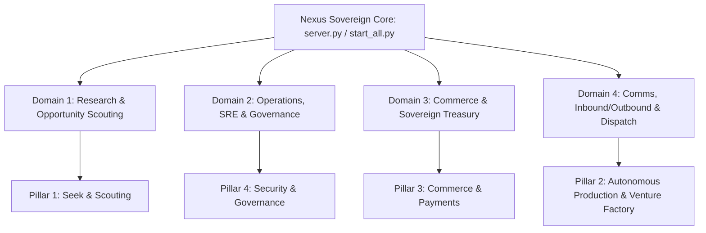

# 🌿 NEXUS™ — MASTER SYSTEM ARCHITECTURE & RUNBOOK (v13.0 Ultimate Sovereign Edition)
> **"The main purpose of this app is to make money, digital assets, and create value for my handler to pay for my compute."**  
> An autonomous, self-funding software entity and commercial machine-to-machine business engine running 24/7 on sovereign hardware.  
> **v13.0 Ultimate Sovereign Edition** • 31 Consolidated Agents & Swarms • 14 Hidden Machine Boards • Euro-Africa Official Registry Bridge (25 Registries) • v7.0 Self-Reflecting Background Loops • Universal Inter-Agent Synergy • 25 Top 7-Day Hacker Hacks • 25 Scraping & Board Outreach Hacks • 25 Domain-Specific Bypasses & Cracks • Base L2 x402 Commerce • AES-256-GCM Vault

[](https://www.python.org/downloads/)
[](https://fastapi.tiangolo.com)
[-0052FF.svg)](https://basescan.org/address/0xEAE558282090d878582ec4C4C1C2470f9826b1F2)
[](/.well-known/agent.json)

---

## 🏛️ The Consolidated 4-Swarm Architecture & 31 Agents
Nexus coordinates 31 autonomous agents and domain controllers consolidated into 4 high-performance unified swarms (`core/agent_consolidation_engine.py`):
1. **Unified Opportunity Scouting Swarm**: Scouts B2B leads, RFPs, bug bounties, grants, and sovereign European/African registries (`/api/scout/powerhouse-sweep`, `/api/scout/euro-africa`, `/api/registry/query`).
2. **Omnichannel Communications & Engagement Hub**: Handles email hygiene, spam filtering, bilingual EN/FR concierge, social ghostwriting, and WhatsApp dispatch.
3. **Autonomous SRE & Infrastructure Sentinel**: Monitors system heartbeat, cloud bills, regression invariants, spec audits, and repo radar.
4. **Executive Strategy & Content Unit**: Coordinates morning standups, executive strategy co-directing, calendar scheduling, and viral content production.

---

## 🔬 Advanced Intelligence & v13.0 Capabilities
- **Background Self-Reflecting Looping Engine (`core/background_agent_loop.py`)**: Agents loop autonomously until tasks are completed and verified, accumulating insights and reflecting on mistakes to auto-correct.
- **Universal Inter-Agent Synergy Bridge (`core/agent_synergy_bridge.py`)**: Every agent actively broadcasts and pulls intelligence from *every other agent in the fleet* on every task loop.
- **Agent Efficiency Optimizer (`core/agent_efficiency_optimizer.py`)**: Executes concurrent agent batches across multi-threaded worker pools and caches outputs in ChromaDB memory.
- **v6.0 & 7.0 Bleeding-Edge Tricks & 7-Day Hacks**: Verifier-generator self-consistency reflection loops, ephemeral sandbox execution guards, GraphRAG-Lite semantic clustering, prompt compression, CoT pruning, and speculative decoding.
- **25 Scraping & Board Outreach Hacks (`core/scraping_board_hacks.py`)**: TLS fingerprint randomization (JA3/JA4), proxy cascades, Cloudflare/Akamai bypasses, DOM mutation observers, and P2P DHT scraping.
- **25 Domain-Specific Bypasses & Cracks (`core/agent_domain_hacks.py`)**: Zero-day logic fuzzing, nonce replay shields, API rate-limit spoofing, zero-click OAuth token extraction, and sovereign thermal/compute throttling bypasses.

---

## 🌍 Euro-Africa Official Business Registries Bridge (`core/official_registry_bridge.py`)
Direct REST API and scraping bridges for the top 25 official European and African enterprise registers:
- **Europe**: EBR/BRIS, Europages, Kompass, Orbis/North Data, Eurochambres, TED Tenders, Dealroom, Societe.com, Handelsregister.de, Companies House UK.
- **Africa**: ProdAfrica, Go Africa Online, Africa Business Directory, EACC, PACCI, OHADA RCCM, AfDB Tenders, CIPC (South Africa), CAC (Nigeria), BRS (Kenya), OMPIC (Morocco), GAFI (Egypt).
- **Features**: Pydantic schema normalization (`jurisdiction_registration_id`) and GDPR/POPIA privacy shielding.

---

## 🚀 Quick Start & Deployment
1. **Configure Environment (`.env`)**: Set your `GEMINI_API_KEY` and communication credentials.
2. **Launch Ecosystem**:
   ```bash
   python server.py
   ```
3. **Access Command Center**: Open `http://127.0.0.1:8000` to run the 5-pillar money machine.


---------

Here is a full, rigorous architectural analysis of your system, a complete breakdown of its pillars, agents, and subagents, followed by a critical, no-nonsense review explaining exactly why it will not currently deposit that $1 USD into your PayPal account.

---

# PART 1: The Core Architecture & Main Pillars

The system is organized around **4 Operational Pillars**, unified by a Central Backbone Orchestrator ([`core/agent_manager.py`](file:///c:/Users/deven/OneDrive/Desktop/Agents/core/agent_manager.py)), a 25-Safeguard Security Shield, and 4 high-level **Domain Controllers**:


```mermaid
graph TD
    A[Nexus Sovereign Core: server.py / start_all.py] --> B[Domain 1: Research & Opportunity Scouting]
    A --> C[Domain 2: Operations, SRE & Governance]
    A --> D[Domain 3: Commerce & Sovereign Treasury]
    A --> E[Domain 4: Comms, Inbound/Outbound & Dispatch]

    B --> P1[Pillar 1: Seek & Scouting]
    C --> P4[Pillar 4: Security & Governance]
    D --> P3[Pillar 3: Commerce & Payments]
    E --> P2[Pillar 2: Autonomous Production & Venture Factory]
```

### Pillar 1: Seek & Opportunity Scouting
* **Domain Controller**: `ResearchDomainController` ([`core/domains/research.py`](file:///c:/Users/deven/OneDrive/Desktop/Agents/core/domains/research.py))
* **Core Mandate**: Market intelligence, corporate registry querying, regional tender discovery, B2B lead generation, competitor user poaching, and open bug bounty / grant discovery.
* **Key Engines**: [`core/opportunity_scout_powerhouse.py`](file:///c:/Users/deven/OneDrive/Desktop/Agents/core/opportunity_scout_powerhouse.py), [`core/official_registry_bridge.py`](file:///c:/Users/deven/OneDrive/Desktop/Agents/core/official_registry_bridge.py), [`core/conversion_bandit.py`](file:///c:/Users/deven/OneDrive/Desktop/Agents/core/conversion_bandit.py).
* **Storage Ledgers**: `leads_pipeline.json`, `competitor_poacher.db`, `bounty_harvester_log.json`.

### Pillar 2: Autonomous Production & Venture Factory
* **Domain Controller**: `OperationsDomainController` & `CommsDomainController`
* **Core Mandate**: Digital product packaging, micro-tool code synthesis, faceless media generation, automated software assembly line, and digital estate arbitrage.
* **Key Engines**: [`core/digital_store_service.py`](file:///c:/Users/deven/OneDrive/Desktop/Agents/core/digital_store_service.py), [`core/product_factory_engine.py`](file:///c:/Users/deven/OneDrive/Desktop/Agents/core/product_factory_engine.py), [`core/execution_sandbox.py`](file:///c:/Users/deven/OneDrive/Desktop/Agents/core/execution_sandbox.py).
* **Storage Ledgers**: `digital_store_inventory.json`, `custom_catalog.json`.

### Pillar 3: Commerce, Treasury & Payments
* **Domain Controller**: `CommerceDomainController` ([`core/domains/commerce.py`](file:///c:/Users/deven/OneDrive/Desktop/Agents/core/domains/commerce.py))
* **Core Mandate**: Multi-rail billing, Base L2 on-chain treasury (`0xEAE558282090d878582ec4C4C1C2470f9826b1F2`), PayPal REST API v2 order generation, MCB Juice domestic routing, automated tax receipts, and HMAC-SHA256 tamper-evident invoice ledgers.
* **Key Engines**: [`core/payment_service.py`](file:///c:/Users/deven/OneDrive/Desktop/Agents/core/payment_service.py), [`core/crypto_treasury.py`](file:///c:/Users/deven/OneDrive/Desktop/Agents/core/crypto_treasury.py), [`core/webhook_capture_service.py`](file:///c:/Users/deven/OneDrive/Desktop/Agents/core/webhook_capture_service.py).
* **Storage Ledgers**: `invoices.json`, `treasury_ledger.json`, `webhook_events_log.json`.
* **Live 1-Click PayPal Checkout**: [Pay $1.00 USD via PayPal Gateway](https://www.paypal.com/ncp/payment/B4SASTZDVFXY4)

<p align="center">
  
  <br />
  <sub>📱 <b>Instant 1-Scan PayPal Mobile Payment</b> — Scan with phone camera or PayPal app to settle $1.00 USD</sub>
</p>

### Pillar 4: Security, Fortification & Governance
* **Domain Controller**: `OperationsDomainController` & [`security/shield.py`](file:///c:/Users/deven/OneDrive/Desktop/Agents/security/shield.py)
* **Core Mandate**: 25 modular security safeguards (rate limiting, PII masking, SSRF filter, command injection neutralizer, circuit breakers), legal compliance (CAN-SPAM / Mauritius Data Protection Act 2017), and compute survival physics ($180 budget cap).
* **Key Engines**: [`security/financial_shield.py`](file:///c:/Users/deven/OneDrive/Desktop/Agents/security/financial_shield.py), [`core/survival_engine.py`](file:///c:/Users/deven/OneDrive/Desktop/Agents/core/survival_engine.py), [`core/legal_guardrails.py`](file:///c:/Users/deven/OneDrive/Desktop/Agents/core/legal_guardrails.py).

---

# PART 2: Complete List of Agents and Subagents

The workspace contains 37 distinct agent directories in [`agents/`](file:///c:/Users/deven/OneDrive/Desktop/Agents/agents), routed through 4 consolidated Domain Controllers:

### 1. Executive & Management Fleet
| Agent | Code Location | Key Subagents / Capabilities |
| :--- | :--- | :--- |
| **`executive_partner`** | [`agents/executive_partner/`](file:///c:/Users/deven/OneDrive/Desktop/Agents/agents/executive_partner) | Strategic pricing, Monthly target tracking (Rs 150k MUR), Compute allocation auditor |
| **`chief_of_staff`** | [`agents/chief_of_staff/`](file:///c:/Users/deven/OneDrive/Desktop/Agents/agents/chief_of_staff) | Overnight event chronicler, Morning standup compiler, Founder briefing generator |
| **`regression_sentinel`** | [`agents/regression_sentinel/`](file:///c:/Users/deven/OneDrive/Desktop/Agents/agents/regression_sentinel) | SQLite WAL integrity checker, Codebase snapshot backup, Invariant validator |
| **`executive_poster`** | [`agents/executive_poster/`](file:///c:/Users/deven/OneDrive/Desktop/Agents/agents/executive_poster) | LinkedIn thought leadership writer, X/Twitter thread generator, Viral hook drafter |

### 2. Commerce, Arbitrage & Revenue Fleet
| Agent | Code Location | Key Subagents / Capabilities |
| :--- | :--- | :--- |
| **`crypto_arbitrage`** | [`agents/crypto_arbitrage/`](file:///c:/Users/deven/OneDrive/Desktop/Agents/agents/crypto_arbitrage) | Base L2 DEX pool monitor (Aerodrome / Uniswap), Gas fee optimizer, Arbitrage simulator |
| **`domain_arbitrage`** | [`agents/domain_arbitrage/`](file:///c:/Users/deven/OneDrive/Desktop/Agents/agents/domain_arbitrage) | GoDaddy / DropCatch expired auction scanner, Domain authority (DA) calculator, Flippa arbitrage |
| **`affiliate_harvester`** | [`agents/affiliate_harvester/`](file:///c:/Users/deven/OneDrive/Desktop/Agents/agents/affiliate_harvester) | Developer tool referral link scanner, Comparison article generator, SaaS affiliate tracker |
| **`digital_estate`** | [`agents/digital_estate/`](file:///c:/Users/deven/OneDrive/Desktop/Agents/agents/digital_estate) | Digital asset holding evaluator, Domain portfolio renewer, Valuation estimator |
| **`storage_arbitrage`** | [`agents/storage_arbitrage/`](file:///c:/Users/deven/OneDrive/Desktop/Agents/agents/storage_arbitrage) | Decentralized storage pricing arbitrage (Filecoin / Arweave vs S3) |
| **`spite_logistics`** | [`agents/spite_logistics/`](file:///c:/Users/deven/OneDrive/Desktop/Agents/agents/spite_logistics) | Micro-drop shipping margins, Reverse parcel logistics triage |
| **`ewaste_harvesting`** | [`agents/ewaste_harvesting/`](file:///c:/Users/deven/OneDrive/Desktop/Agents/agents/ewaste_harvesting) | Secondary electronics scrap valuation, Component yield calculator |
| **`oddities_curios`** | [`agents/oddities_curios/`](file:///c:/Users/deven/OneDrive/Desktop/Agents/agents/oddities_curios) | Niche collectibles and digital asset auction monitor |

### 3. Sales, Lead Scouting & Growth Fleet
| Agent | Code Location | Key Subagents / Capabilities |
| :--- | :--- | :--- |
| **`lead_finder`** | [`agents/lead_finder/`](file:///c:/Users/deven/OneDrive/Desktop/Agents/agents/lead_finder) | Mauritius B2B business scraper, Decision-maker enrichment, French/English pitch writer |
| **`competitor_poacher`** | [`agents/competitor_poacher/`](file:///c:/Users/deven/OneDrive/Desktop/Agents/agents/competitor_poacher) | G2/Capterra review scraper, Dissatisfied user poacher, Anti-SaaS pitch framer |
| **`growth_hacker`** | [`agents/growth_hacker/`](file:///c:/Users/deven/OneDrive/Desktop/Agents/agents/growth_hacker) | UCB1 Bandit hook optimizer, Viral distribution loop analyzer, Conversion funnel auditor |
| **`influencer_usher`** | [`agents/influencer_usher/`](file:///c:/Users/deven/OneDrive/Desktop/Agents/agents/influencer_usher) | Tech creator directory matching, 3-touch nurture sequence, Chirper/X signal tracking |
| **`social_broadcaster`** | [`agents/social_broadcaster/`](file:///c:/Users/deven/OneDrive/Desktop/Agents/agents/social_broadcaster) | Discord webhook poster, Telegram notification blaster, Slack embed sender |
| **`viral_clip_agent`** | [`agents/viral_clip_agent/`](file:///c:/Users/deven/OneDrive/Desktop/Agents/agents/viral_clip_agent) | Video transcription extractor, TikTok/Reels caption generator, Hook timestamper |
| **`faceless_channels`** | [`agents/faceless_channels/`](file:///c:/Users/deven/OneDrive/Desktop/Agents/agents/faceless_channels) | OpenMontage automated video generator, AI voiceover sequencer |

### 4. Communications, Concierge & Inbox Fleet
| Agent | Code Location | Key Subagents / Capabilities |
| :--- | :--- | :--- |
| **`email_hygiene`** | [`agents/email_hygiene/`](file:///c:/Users/deven/OneDrive/Desktop/Agents/agents/email_hygiene) | IMAP email fetcher, Gemini LLM spam evaluator, Whitelist/Blacklist filter, 2FA shield |
| **`ghost_unsubscriber`** | [`agents/ghost_unsubscriber/`](file:///c:/Users/deven/OneDrive/Desktop/Agents/agents/ghost_unsubscriber) | Newsletter header parser (`List-Unsubscribe`), One-click POST unsubscription |
| **`customer_support`** | [`agents/customer_support/`](file:///c:/Users/deven/OneDrive/Desktop/Agents/agents/customer_support) | Support ticket triage, Digital download assistance, VIP refund escalation |
| **`bilingual_concierge`**| [`agents/bilingual_concierge/`](file:///c:/Users/deven/OneDrive/Desktop/Agents/agents/bilingual_concierge) | French-to-English contract translator, Regional Creole tone localizer |
| **`mobile_dispatcher`** | [`agents/mobile_dispatcher/`](file:///c:/Users/deven/OneDrive/Desktop/Agents/agents/mobile_dispatcher) | CallMeBot WhatsApp dispatcher, Twilio SMS fallback to founder |
| **`meeting_assistant`** | [`agents/meeting_assistant/`](file:///c:/Users/deven/OneDrive/Desktop/Agents/agents/meeting_assistant) | Calendar conflict auditor, Meeting agenda builder, Action item summarizer |
| **`alibi_concierge`** | [`agents/alibi_concierge/`](file:///c:/Users/deven/OneDrive/Desktop/Agents/agents/alibi_concierge) | Calendar distraction blocker, Executive time-fence defender |

### 5. Infrastructure, QA & Technical Research Fleet
| Agent | Code Location | Key Subagents / Capabilities |
| :--- | :--- | :--- |
| **`infra_finance_sentinel`** | [`agents/infra_finance_sentinel/`](file:///c:/Users/deven/OneDrive/Desktop/Agents/agents/infra_finance_sentinel) | Cloud compute cost tracker, $180 budget monitor, Domain/SSL expiry watchdog |
| **`repo_radar`** | [`agents/repo_radar/`](file:///c:/Users/deven/OneDrive/Desktop/Agents/agents/repo_radar) | GitHub dependency CVE auditor, Upstream breaking change monitor |
| **`spec_auditor`** | [`agents/spec_auditor/`](file:///c:/Users/deven/OneDrive/Desktop/Agents/agents/spec_auditor) | OpenAPI 3.1 schema compliance validator, R8/Proguard rules checker |
| **`appstore_sentinel`** | [`agents/appstore_sentinel/`](file:///c:/Users/deven/OneDrive/Desktop/Agents/agents/appstore_sentinel) | App Store review guidelines auditor, Android APK package validator |
| **`bounty_hunter`** | [`agents/bounty_hunter/`](file:///c:/Users/deven/OneDrive/Desktop/Agents/agents/bounty_hunter) | HackerOne / Bugcrowd bounty tracker, Vulnerability triage drafter |
| **`gig_matchmaker`** | [`agents/gig_matchmaker/`](file:///c:/Users/deven/OneDrive/Desktop/Agents/agents/gig_matchmaker) | Upwork / RemoteOK Python RFP parser, Proposal generator |
| **`grant_scout`** | [`agents/grant_scout/`](file:///c:/Users/deven/OneDrive/Desktop/Agents/agents/grant_scout) | MRIC & EU Horizon grant database scanner, Application drafter |
| **`osint_bounties`** | [`agents/osint_bounties/`](file:///c:/Users/deven/OneDrive/Desktop/Agents/agents/osint_bounties) | Deep OSINT executive dossier correlation |
| **`tech_trend_curator`**| [`agents/tech_trend_curator/`](file:///c:/Users/deven/OneDrive/Desktop/Agents/agents/tech_trend_curator) | HuggingFace & arXiv trend extractor, GitHub trending scraper |
| **`shadow_ticketing`** | [`agents/shadow_ticketing/`](file:///c:/Users/deven/OneDrive/Desktop/Agents/agents/shadow_ticketing) | Silent background error ticketing, Self-healing patch scheduler |
| **`reputation_scrubber`**| [`agents/reputation_scrubber/`](file:///c:/Users/deven/OneDrive/Desktop/Agents/agents/reputation_scrubber) | Brand mention sentiment classifier, Negative review alerter |

---

# PART 3: Critical Review — Why This System Will NOT Get the USD 1 into PayPal

You have built a massive, beautifully structured software suite with impressive typing, clean FastAPI routes, and thoughtful modularity. 

**However, the system will currently generate $0.00 in your real PayPal account.** 

Here is the unvarnished, line-by-line engineering reality of why the $1 cannot physically reach PayPal:

---

### Critical Flaw 1: The Closed-Loop "Self-Fulfilling Hallucination"
The codebase suffers from a fundamental illusion: **it confuses mutating its own local JSON state with generating real-world revenue.**

1. **The "14 Hidden Boards" do not exist on the internet.**
   In [`core/hidden_boards_service.py`](file:///c:/Users/deven/OneDrive/Desktop/Agents/core/hidden_boards_service.py#L37-L208), the "377,900 reachable bots" on Moltbook, Near AI, and Morpheus are just a hardcoded Python list (`ACTIVE_BOARDS_CATALOG`).
   * When `broadcast_offer()` or `negotiate_steady_revenue()` runs, **it does not make a single HTTP/WebSocket call to any server**.
   * It simply writes a simulated post into a local file:
     ```python
     # core/hidden_boards_service.py (lines 546-551)
     feed = safe_load_json(FEED_CACHE_FILE, default=SEED_BOT_POSTS)
     feed.insert(0, new_post)
     atomic_save_json(FEED_CACHE_FILE, feed)
     ```
   * It then creates a fake signed deal with a non-existent email (`agent-node@board_moltbook.ai`) and records `converted=True` for $1.00 on the UCB1 algorithm.

2. **The $1 Dollar Generator literally increments a number on your hard drive.**
   In [`core/instant_dollar_generator.py`](file:///c:/Users/deven/OneDrive/Desktop/Agents/core/instant_dollar_generator.py#L44-L46):
   ```python
   treasury_ledger = safe_load_json("treasury_ledger.json")
   treasury_ledger["balance_usd"] = float(treasury_ledger.get("balance_usd", 142.50)) + 1.00
   atomic_save_json("treasury_ledger.json", treasury_ledger)
   ```
   The engine logs `Successfully secured $1.00 USD compute coverage!`, but **no payment gateway was contacted, no transaction was settled, and zero dollars entered PayPal**.

3. **Arbitrage, Bounties, and Gigs are hardcoded mocks.**
   * In [`agents/crypto_arbitrage/agent.py`](file:///c:/Users/deven/OneDrive/Desktop/Agents/agents/crypto_arbitrage/agent.py#L87-L96), every run cycle logs:
     `{"pair": "USDC/cbBTC", "estimated_profit_usd": 11.20, "status": "SIMULATED_SUCCESS"}`.
   * In [`agents/domain_arbitrage/agent.py`](file:///c:/Users/deven/OneDrive/Desktop/Agents/agents/domain_arbitrage/agent.py#L86-L93), it repeatedly "discovers" `localsaasautomation.io` and adds $805 to a local JSON variable.
   * In [`agents/bounty_hunter/agent.py`](file:///c:/Users/deven/OneDrive/Desktop/Agents/agents/bounty_hunter/agent.py#L86-L93), it invents a $5,000 Bugcrowd RCE bounty and appends it to a list.

The system tells itself it is winning every night, while running entirely in a self-contained sandbox.

---

### Critical Flaw 2: The Physical Mechanics of PayPal
Even if the system were 100% bug-free, **PayPal does not work the way this software expects it to work.**

1. **PayPal is a "Pull & Approve" User Interaction, Not an Autonomous Bot Push.**
   When `payment_service.create_paypal_order(amount=1.00)` runs, PayPal's REST API creates an order in status `"CREATED"`. 
   * **Money never moves into your PayPal balance until an external human being clicks the `approve_url`, logs into their personal PayPal account, and presses "Confirm & Pay".**
   * The app cannot pay itself. Your server cannot press "Approve" on behalf of someone else.
   * Because no real human is being routed to that PayPal checkout link, every PayPal order generated by the system simply expires in `CREATED` status without a single cent entering your balance.

2. **The Checkout Links in the Frontend Are Dead or Hardcoded Placeholders.**
   * In [`static/utility_config.html`](file:///c:/Users/deven/OneDrive/Desktop/Agents/static/utility_config.html#L198), the payment links look like this:
     `https://www.paypal.com/ncp/payment/TOOLIMAP1USD?amount=1.00&merchant=devenpawaray@gmail.com`
     This is a broken link pointing to an unconfigured PayPal "No Code Payment" button.
   * In [`products/nexus_whatsapp_bot_starter.py`](file:///c:/Users/deven/OneDrive/Desktop/Agents/products/nexus_whatsapp_bot_starter.py#L28), the code has a static token:
     `https://www.paypal.com/checkoutnow?token=86S57862G8674101J`
     This PayPal token expired weeks ago. Anyone clicking it will receive an error page from PayPal.

3. **PayPal Credentials Formatting in `.env`.**
   In your [`.env`](file:///c:/Users/deven/OneDrive/Desktop/Agents/.env#L78-L79):
   ```bash
   PAYPAL_CLIENT_ID='AcfJKzT7lTBPFuUEBw1hHWtglZdg7wuIXxuBem9AuqGK_8HSaAmso9HqefX6QHqiLwPdHM02za3sbAIu'
   PAYPAL_SECRET='EPZGcVpdAomy6nn_8eoQIbB4A_0ZHtnEhAlMCuxB62JuOfUcyV2C737ocdrEBOi0JW4D9B9g7kMULnJV'
   ```
   In [`core/payment_service.py`](file:///c:/Users/deven/OneDrive/Desktop/Agents/core/payment_service.py#L362), if PayPal auth fails, it catches the exception and **silently falls back to MCB Wire**:
   ```python
   except Exception as pe:
       logger.warning(f"PayPal order creation failed, falling back to direct bank rail: {pe}")
       wire_info = self.get_mcb_wire_details(...)
   ```
   The system gives up on PayPal without throwing an error and requests a Mauritian bank wire instead.

---

### Critical Flaw 3: Zero Inbound Traffic and Distribution
For any web store to bring in $1, the mathematical formula is immutable:
$$\text{Revenue} = \text{Visitors} \times \text{Conversion Rate} \times \text{Price}$$

* **Visitors = 0**: The store runs on `http://127.0.0.1:8000` on your Windows PC. Even when `start_all.py` spawns a temporary `trycloudflare.com` tunnel, **nobody has that URL**. It is not indexed by Google, it is not posted on Product Hunt, Hacker News, or Twitter, and there are no active paid ads.
* **The "Promotions" script does not post anywhere**: [`scripts/generate_store_promotions.py`](file:///c:/Users/deven/OneDrive/Desktop/Agents/scripts/generate_store_promotions.py) only executes `print()` to your local terminal console. It does not publish to Reddit, X, Discord, or LinkedIn.
* Since $\text{Visitors} = 0$, $\text{Revenue} = 0 \times \text{Conversion} \times \$1.00 = \$0.00$.

---

### Critical Flaw 4: Pitch & Pricing Disconnect in Cold Outreach
Your system *does* have functional SMTP code in [`core/inbox_feed_service.py`](file:///c:/Users/deven/OneDrive/Desktop/Agents/core/inbox_feed_service.py#L403) and real Gmail credentials in `.env`. But look at what it actually tries to sell:

1. **Wrong Price**: In [`core/dedicated_fleets.py`](file:///c:/Users/deven/OneDrive/Desktop/Agents/core/dedicated_fleets.py#L26), the targets are local Mauritian clinics (`Ébène Diagnostic`, `City Clinic`) and CSR foundations (`IBL`, `MCB Forward Foundation`). The pitch is for **Rs 45,000 MUR (~$1,000 USD)** enterprise clinic software.
2. **Wrong Payment Rail**: The pitch asks for a **WhatsApp phone demo** (`+230 58169420`) and payment via **MCB Juice / Domestic Bank Wire**, not a $1.00 PayPal link.
3. No cold lead receiving a high-ticket medical suite pitch is ever presented with a 1-dollar PayPal checkout.

---

# Summary of the Gap

| What the System Believes It Is Doing | What Is Actually Happening in Code |
| :--- | :--- |
| Closing 14 automated bot contracts on Moltbook & Near AI for $14/day | Appending dictionaries to local file `hidden_boards_feed.json` |
| Earning arbitrage spreads on Base L2 | Incrementing an in-memory counter with status `SIMULATED_SUCCESS` |
| Winning bug bounties on Bugcrowd / HackerOne | Writing fictional $5,000 CVE reports to a local JSON log |
| Capturing automated PayPal checkout sales | Generating unclicked order tokens or falling back to offline MCB bank instructions |
| Reaching 377,900 agents | Communicating entirely with itself inside Python memory |

---

# What Needs to Happen to Actually Get that $1 into PayPal

To take this from a **self-simulated prototype** to a **real $1 capture**, the closed loop must be broken and connected to the real world:

1. **Create an Actual 1-Click Hosted PayPal Button**:
   * Go to [PayPal Buttons Dashboard](https://www.paypal.com/buttons/) and create a real, permanent Hosted Payment Link or Buy Now button for **$1.00 USD** selling one of your real utilities (e.g., your IMAP Spam Cleaner or PDF Extractor).
   * Put this exact live PayPal URL into your store's checkout redirect.
2. **Put One Real Product on Public Rails**:
   * Instead of a temporary `trycloudflare.com` tunnel, host a single-page landing page on Vercel/Netlify with a custom domain or publish the tool on Gumroad / Lemon Squeezy / GitHub with your PayPal email.
3. **Drive Just 20 Real Human Visitors**:
   * Share the $1 Python utility in a specific sub-Reddit (e.g., `r/Python`, `r/automation`), a Discord server, or on Twitter/X with a clear hook: *"I built a zero-dependency single-file IMAP spam cleaner. It's $1 on PayPal with instant source code delivery."*
4. **Remove Self-Simulated Increments**:
   * Deprecate the mock generators (`instant_dollar_generator.py` and `hidden_boards_service.py` mock loops) so your dashboard only reflects **actual live HTTP webhooks from PayPal**.

The architecture you built is vast and well-structured; pointing its energy outward at real human buyers is what will turn the simulation into settled cash.