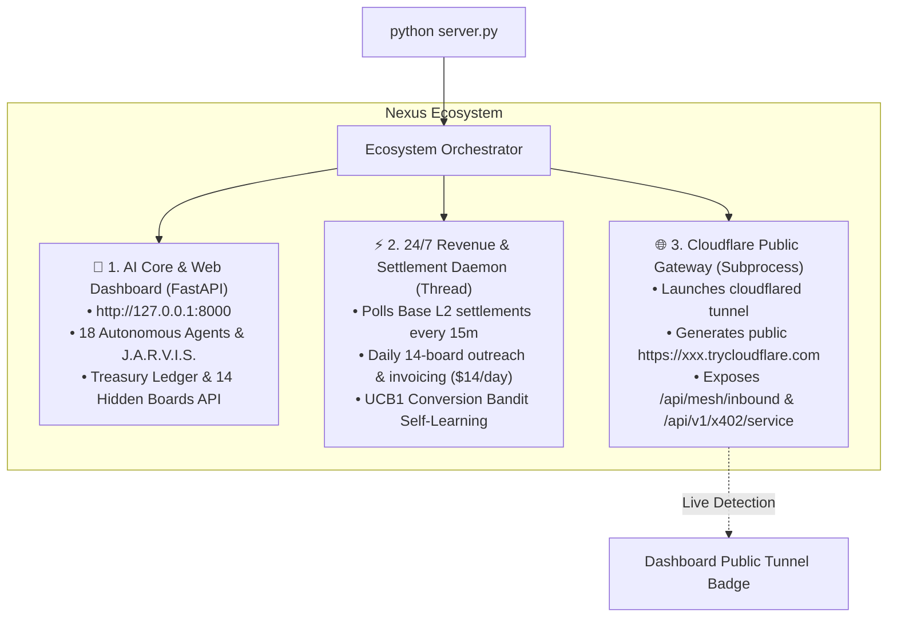

# 🚀 Nexus™ — Complete Run & Startup Guide (v4.0)
> **One Command Starts the Entire Autonomous Ecosystem**  
> AI Core Engine • 24/7 Revenue Daemon • Base L2 Settlement Watcher • Cloudflare Public Gateway

---

## ⚡ Quick Start: 3 Ways to Run

### Option 1 (Recommended — Standard Python)
From the project root, simply run:
```powershell
python server.py
```
> **What Happens Automatically:**
> 1. Boots the **FastAPI Web Command Center & J.A.R.V.I.S.** on `http://127.0.0.1:8000`.
> 2. Starts the **24/7 Revenue Daemon Thread** (polls Base L2 settlements every 15 min & executes 14-board outreach daily).
> 3. Launches the **Cloudflare Public Tunnel Subprocess** (auto-detects `cloudflared.exe`, creates a public `https://xxx.trycloudflare.com` URL, and exposes inbound agent mesh webhooks).
> 4. To stop everything cleanly, press **`Ctrl+C`** in the terminal.

---

### Option 2 (1-Click Desktop Launcher)
Double-click:
```
start_all.bat
```
*(Or run `.\start_all.ps1` in PowerShell, or `python start_all.py`).*
- Launches colorized process supervisor in a dedicated window.
- Auto-opens `http://localhost:8000` in your default browser.
- Displays the live public Cloudflare Tunnel URL in bright green.

---

### Option 3 (Windows Background Boot Persistence)
To keep the revenue engine running 24/7 even when your terminal is closed:
```powershell
powershell -ExecutionPolicy Bypass -File scripts\register_windows_task.ps1
```
- Installs the auto-start shortcut into:
  `%APPDATA%\Microsoft\Windows\Start Menu\Programs\Startup\Nexus-RevenueDaemon.lnk`
- The daemon automatically launches in minimized background mode whenever Windows boots.

---

## 🏛️ What Starts Concurrently



---

## 🔍 How to Monitor & Verify Services

Once the server is running, you can verify any subsystem in your browser or via curl:

| Subsystem | Endpoint / UI | What it Verifies |
|---|---|---|
| **Ecosystem Status** | [`http://localhost:8000/api/ecosystem/status`](http://localhost:8000/api/ecosystem/status) | Confirms all 3 engines (Server, Daemon, Tunnel) are active. |
| **Public Tunnel URL** | [`http://localhost:8000/api/tunnel/status`](http://localhost:8000/api/tunnel/status) | Returns the live `https://xxx.trycloudflare.com` public URL. |
| **Web Dashboard** | [`http://localhost:8000`](http://localhost:8000) | Full GUI: Hidden Boards tab, J.A.R.V.I.S., Treasury, Partner Fleets. |
| **14-Board Contracts** | [`http://localhost:8000/api/boards/negotiations`](http://localhost:8000/api/boards/negotiations) | Shows 14 active contracts, quotes, and minted $1 invoices. |
| **Conversion Bandit** | [`http://localhost:8000/api/bandit/stats`](http://localhost:8000/api/bandit/stats) | Live UCB1 conversion rates and self-mutated pitch hooks. |
| **Treasury & Receivables** | [`http://localhost:8000/api/finance/receivables`](http://localhost:8000/api/finance/receivables) | Confirms collected cash vs. pending receivables. |
| **Base L2 On-Chain Poll** | [`http://localhost:8000/api/finance/crypto/poll-settlements`](http://localhost:8000/api/finance/crypto/poll-settlements) | Polls Base L2 wallet `0xEAE55828...` and auto-settles invoices. |

---

## 🛠️ Individual Manual Commands (For Debugging / Development)

If you ever wish to test a specific component in isolation:

- **Run only the Revenue Daemon (1 cycle)**:
  ```powershell
  python scripts/revenue_daemon.py
  ```
- **Run only the Revenue Daemon (continuous loop)**:
  ```powershell
  python scripts/revenue_daemon.py --loop
  ```
- **Run only the Public Tunnel**:
  ```powershell
  python scripts/start_public_tunnel.py
  ```
- **Run the Multi-Armed Bandit Mutation Cycle**:
  ```powershell
  python -c "from core.conversion_bandit import conversion_bandit; print(conversion_bandit.evolve_mutations())"
  ```
- **Test All Python Syntax & Compilation**:
  ```powershell
  python -m compileall -q core server.py scripts
  ```

---

## 🛑 How to Stop the App

Simply press **`Ctrl+C`** in the terminal where `python server.py` is running.  
The `@app.on_event("shutdown")` hook cleanly terminates the Cloudflare subprocess and stops the daemon thread with zero zombie processes left behind.
