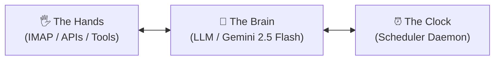
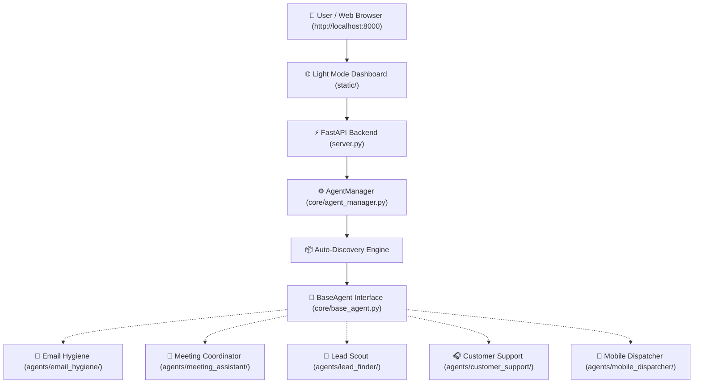

# 📘 Nexus Workforce: Complete Project Guide & Learning Notes

> **Welcome to your AI Agent Development Journey!**
> This document is your comprehensive knowledge base and permanent reference guide. It contains all the concepts, architectures, design decisions, and step-by-step instructions for everything built in this project.

---

## 📑 Table of Contents
1. [Core Concepts & Mental Models (Beginner Friendly)](#1-core-concepts--mental-models)
2. [High-Level Architecture (The Backbone System)](#2-high-level-architecture)
3. [The 7 Must-Have Security & Triage Features](#3-the-7-must-have-features)
4. [How the Modular Plugin System Works](#4-how-the-modular-plugin-system-works)
5. [How to Add a Brand New Agent in 3 Steps](#5-how-to-add-a-new-agent)
6. [Web Dashboard & API Endpoints](#6-web-dashboard--api-endpoints)
7. [Running & Configuration Cheatsheet](#7-running--configuration-cheatsheet)

---

## 1. Core Concepts & Mental Models

When building an autonomous "AI Employee", we combine three fundamental computing pillars:



1. **The Brain (LLM Reasoning)**
   - Instead of writing hundreds of brittle `if/else` rules for every kind of email, we use an LLM (Google Gemini 2.5 Flash) as a smart judge.
   - We give it strict JSON schema instructions so it always returns structured data: `is_spam (bool)`, `confidence (float)`, `category (str)`, and `reason (str)`.
   - **Safety Fail-Safe**: If the API ever drops or times out, the brain defaults to `is_spam: false` so a legitimate email is **never** deleted by accident.

2. **The Hands (APIs & Protocols)**
   - To talk to Gmail/Outlook without a human clicking a browser, we use **IMAP (Internet Message Access Protocol)** over SSL (Port 993).
   - It searches for unread (`UNSEEN`) emails, decodes MIME headers & plain text bodies, and executes actions (e.g. `COPY` to Trash folder + `STORE \Deleted`).

3. **The Clock (Autonomous Heartbeat)**
   - Autonomous agents need a trigger. Our background scheduler loop wakes up periodically (e.g., every 60 minutes), runs a scan cycle, and goes back to sleep.

---

## 2. High-Level Architecture

Our project is structured into a **Modular Backbone**:



---

## 3. The 7 Must-Have Features (Email Agent)

| # | Feature | Purpose | Implementation Location |
| :-: | :--- | :--- | :--- |
| **1** | **Immunity Shield** | Hardcoded fast-pass for OTPs, 2FA verification codes, password resets, and VIP domains (`WHITELIST_DOMAINS`). AI is bypassed with zero false-positive risk. | `spam_classifier.py` (`check_immunity_shield`) |
| **2** | **Two-Tier Actions** | **High-Confidence Spam (≥ 90%)** moves to `[Gmail]/Trash`.<br>**Borderline Junk (70%–89%)** moves to `[Gmail]/Spam` (Review Quarantine). | `agents/email_hygiene/agent.py` |
| **3** | **Brand Spoofing Trap** | Catches phishing emails where the display name says "Apple" or "PayPal" but the sending address is `@random-scam.xyz`. | `spam_classifier.py` (`check_brand_spoofing`) |
| **4** | **Unsubscribe Extractor** | Parses RFC 2369 `List-Unsubscribe` headers and surfaces direct 1-click links in reports. | `email_client.py` (`_extract_unsubscribe_url`) |
| **5** | **Daily Triage Digest** | Automatically appends daily summaries to `daily_report.md` with full statistics. | `agents/email_hygiene/agent.py` |
| **6** | **Fast Blacklist Engine** | Instantly trashes banned TLDs (`.xyz`, `.top`, `.buzz`) or banned keywords without wasting AI tokens. | `spam_classifier.py` (`check_blacklist`) |
| **7** | **Undo & Recovery Ledger** | Logs every moved email in `trash_ledger.json`. Supports 1-click restore back to INBOX. | `server.py` & `agent.py` (`--restore`) |

---

## 4. How the Modular Plugin System Works

1. **`core/base_agent.py`**: Defines the blueprint (`BaseAgent`). Every agent has an `agent_id`, `name`, `description`, `schedule_minutes`, and methods `run_cycle()` and `get_stats()`.
2. **`core/agent_manager.py`**: A central singleton orchestrator that dynamically inspects the `agents/` folder using Python's `importlib` and `inspect` modules. It registers any class that inherits from `BaseAgent`.
3. **`server.py`**: Exposes `/api/agents` so the frontend dashboard can render interactive cards for every discovered agent automatically.

---

## 5. How to Add a New Agent (In 3 Steps)

Whenever you want to build a new agent (e.g. Lead Researcher, Support Bot, Social Media Monitor):

1. Create a folder in `agents/` (e.g. `agents/lead_finder/`).
2. Create an `agent.py` file with this template:
```python
from core.base_agent import BaseAgent

class LeadFinderAgent(BaseAgent):
    def __init__(self):
        super().__init__(
            agent_id="lead_finder",
            name="B2B Lead Research Agent",
            description="Finds and verifies new business leads.",
            schedule_minutes=180
        )

    def run_cycle(self):
        # Place your custom task logic here
        return {"leads_found": 10}

    def get_stats(self):
        return [{"title": "Leads", "value": 10, "color": "green"}]
```
3. Restart the server or hit refresh on the dashboard. **Your new agent will automatically appear with its own controls, status badge, and stats!**

---

## 6. Web Dashboard & API Endpoints

- **Web Dashboard URL**: `http://localhost:8000`
- **Key REST Endpoints**:
  - `GET /api/agents`: Lists all loaded agents.
  - `POST /api/agents/{agent_id}/run`: Manually runs a specific agent.
  - `POST /api/agents/{agent_id}/toggle`: Enables / disables an agent.
  - `POST /api/scheduler/toggle`: Starts or stops the 24/7 background scheduler.
  - `GET /api/ledger`: Fetches all trashed/quarantined items.
  - `POST /api/restore`: Restores an email UID from Trash to INBOX.
  - `POST /api/simulate`: Real-time AI reasoning sandbox for test emails.
  - `GET /api/rules` & `POST /api/rules`: Reads and updates whitelist/blacklist rules.

---

## 7. Running & Configuration Cheatsheet

### Starting the Web Dashboard & Backbone:
```bash
uv run python server.py
```

### Running the Standalone CLI Agent:
```bash
# Single scan
uv run agent.py

# List trashed emails
uv run agent.py --list-trashed

# Restore an email
uv run agent.py --restore <UID>
```

### Testing the AI Security Pipeline:
```bash
uv run test_brain.py
```
